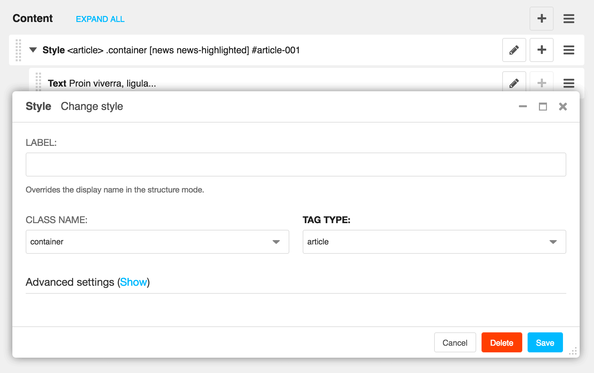

================
django CMS Style
================

|pypi| |build| |coverage|

**django CMS Style** is a plugin for `django CMS <http://django-cms.org>`_
that allows you to create a HTML container containing classes, styles, ids
and other attributes definable through the plugins settings.

This addon is compatible with `Divio Cloud <http://divio.com>`_ and is also available on the
`django CMS Marketplace <https://marketplace.django-cms.org/en/addons/browse/djangocms-style/>`_
for easy installation.

Contributing
============

This is a an open-source project. We'll be delighted to receive your
feedback in the form of issues and pull requests. Before submitting your
pull request, please review our `contribution guidelines
<http://docs.django-cms.org/en/latest/contributing/index.html>`_.

One of the easiest contributions you can make is helping to translate this addon on
`Transifex <https://www.transifex.com/projects/p/djangocms-style/>`_.

Documentation
=============

See ``REQUIREMENTS`` in the `setup.py <https://github.com/divio/djangocms-style/blob/master/setup.py>`_
file for additional dependencies:

* Python 2.7, 3.4 or higher
* Django 1.11 or higher

Installation
------------

For a manual install:

* run ``pip install djangocms-style``
* add ``djangocms_style`` to your ``INSTALLED_APPS``
* run ``python manage.py migrate djangocms_style``

Configuration
-------------

django CMS Style enables you to provide a list of predefined classes to be
displayed as first options, the default choices are: ::

    DJANGOCMS_STYLE_CHOICES = ['container', 'content', 'teaser']

You are encouraged to modify that setting to your projects specifications.

This addon provides a ``default`` template for all instances. You can provide
additional template choices by adding a ``DJANGOCMS_STYLE_TEMPLATES``
setting::

    DJANGOCMS_STYLE_TEMPLATES = [
        ('feature', _('Feature')),
    ]

You'll need to create the `feature` folder inside ``templates/djangocms_style/``
otherwise you will get a *template does not exist* error. You can do this by
copying the ``default`` folder inside that directory and renaming it to
``feature``.

The available tags can also be configured, the default choices are: ::

    DJANGOCMS_STYLE_TAGS = ['div', 'article', 'section', 'header', 'footer',
                            'h1', 'h2', 'h3', 'h4', 'h5', 'h6']

NOTICE::

    All tags included in this list should be "paired tags" that require a
    closing tag. It does not make sense to attempt to use 'img', 'input',
    'meta', or other self-closing tags in this setting.

    Also, the developer is advised to choose the tag-types wisely to avoid HTML
    validation issues and/or unintentional security vulnerabilities. For
    example, the 'script' tag should never be allowed in
    ``DJANGOCMS_STYLE_TAGS`` (though, we do not prevent this). If you have
    an application where you find yourself wishing to do this, please see
    djangocms-snippet as an alternative, but note these projects also come
    with appropriate security warnings.

After that you can place any number of other plugins inside this style plugin.
It will create a div (or other tag-type) with a class that was prior selected
around the contained plugins.

Running Tests
-------------

You can run tests by executing::

    virtualenv env
    source env/bin/activate
    pip install -r tests/requirements.txt
    python setup.py test

.. |pypi| image:: https://badge.fury.io/py/djangocms-style.svg
    :target: http://badge.fury.io/py/djangocms-style
.. |build| image:: https://travis-ci.org/divio/djangocms-style.svg?branch=master
    :target: https://travis-ci.org/divio/djangocms-style
.. |coverage| image:: https://codecov.io/gh/divio/djangocms-style/branch/master/graph/badge.svg
    :target: https://codecov.io/gh/divio/djangocms-style
